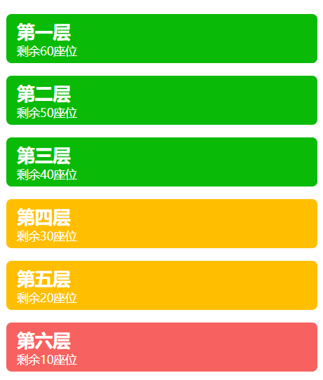
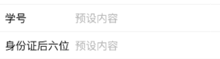
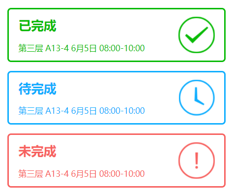
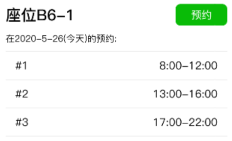

| 操作介绍                                                     | 图像                                                         |
| ------------------------------------------------------------ | ------------------------------------------------------------ |
| 每个楼层通过座位余量来调整楼层颜色，点击指定楼层可以获取具体楼层座位排布详细情况，以进行座位预约。 |  |
| 输入学号以及身份证后六位来认证身份信息                       |  |
| 点击待完成可以看到待完成的座位预约凭证                       |  |
| 包含座位号以及被预约的时间段信息，点击预约按钮可以选择可选时间段进行预约 |  |
| 点击头像可以查看头像                                         |  |