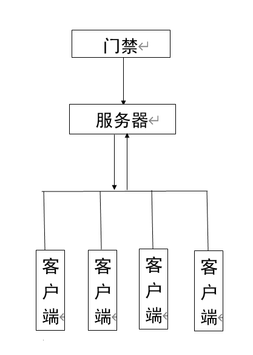

# 可行性研究报告

## 引言

### 编写目的

为了开发图书馆座位预约管理系统，编写此可行性研究报告。

目的在于分析项目可行性，确定开发方案、估测资金、人员需求。

预期的读者：

- 本项目的设计、开发、测试人员
- 本项目的客户、用户、审核人员

### 背景

说明：

1. 项目名称：图书馆座位管理系统

2. 项目角色：

   | 角色       | 对象                               |
   | ---------- | ---------------------------------- |
   | 任务提出者 | 18级软件工程ZYH班Alipapa小组       |
   | 开发者     | 18级软件工程ZYH班Alipapa小组       |
   | 用户       | 西北大学师生                       |
   | 部署目标   | 多部RFID打卡机、云服务器、移动终端 |

3. 该软件系统同其他系统或其他机构的基本的相互来往关系

   - 本软件系统隶属于西北大学图书馆，是面向图书馆座位资源的管理系统。

   - 西北大学图书馆及其隶属机构、组织拥有其操作管理权限。

   - 西北大学师生为其主要服务对象，拥有其使用权限。

   - 2018级软件工程课程ZYH班Alipapa小组为其开发、维护及更新团队。负责对该软件系统的开发、维护及更新。

### 定义

- RFID: (Radio Frequency IDentification)射频识别技术，用来读用户的校园卡
- 图书馆：指西北大学长安校区图书馆
- C/S架构：客户端/服务端架构
- Android：中文常译作安卓，是一个基于Linux内核的开放源代码移动操作系统
- iOS：*iOS*是由苹果公司开发的移动操作系统
- nodejs：是一个基于Chrome V8 引擎 的JavaScript 运行时
- linux：Linux，全称GNU/Linux，是一套免费使用和自由传播的类UNIX操作系统
- JDK：JDK是 Java 语言的软件开发工具包，主要用于移动设备、嵌入式设备上的java应用程序
- docker：Docker 是一个开源的应用容器引擎，让开发者可以打包他们的应用以及依赖包到一个可移植的镜像中
- MySQL：MySQL是一个关系型数据库管理系统，由瑞典*MySQL* AB 公司开发，属于 Oracle 旗下产品
- windows：Microsoft*Windows*操作系统是美国微软公司研发的一套操作系统
- macOS：*Mac OS*是一套运行于苹果Macintosh系列电脑上的操作系统

### 参考资料

#### 后端

- [Java Spring框架](https://spring.io/)

- [Maven](http://maven.apache.org/)

#### 前端

- [微信小程序开发文档](https://developers.weixin.qq.com/miniprogram/dev/framework/)
- [微信开发者工具](https://developers.weixin.qq.com/doc/offiaccount/OA_Web_Apps/Web_Developer_Tools.html#5)
- [npm](https://www.npmjs.com/)

## 可行性研究的前提

### 要求

- ##### 功能

  为西北大学师生提供图书馆座位的预约、占位服务。

- ##### 性能

  ###### 精度

  | 项目     | 精度要求                            |
  | -------- | ----------------------------------- |
  | 时间信息 | 精确到秒                            |
  | 传输     | https传输，要求无损，并在出错时重试 |

  ###### 时间特性要求

  | 项目                                 | 要求                       |
  | ------------------------------------ | -------------------------- |
  | 客户端请求响应时间                   | 30ms以内（不包含公网延迟） |
  | 数据更新处理时间                     | 40ms以内                   |
  | 内部传输超时（指打卡机和服务端之间） | 默认10s，可更改            |
  | 服务端吞吐量                         | 暂定500 QPS                |

  ###### 灵活性

  | 潜在的变化 | 应对                               |
  | ---------- | ---------------------------------- |
  | 吞吐量     | 扩容                               |
  | 运行环境   | 本系统的客户端、服务端均为跨平台的 |

- ##### 输出

  - 座位预约状态：图书馆座位结构、每个座位的预约情况
  - 用户信息：用户预约记录、违约记录、预约状态（是否可以预约）

- ##### 输入

  - 图书馆座位结构：每个座位的座位号、所属的桌子、在第几个位置、楼层数
  - 预约：包含预约用户身份信息、预约时间段、座位号
  - 用户进馆、离馆：用户身份、进馆时间

- ##### 处理流程

  

- ##### 安全保密

  应保证除学校、团队外无第三方可获取学生相关信息。

- ##### 同本系统相连的其它系统

  - 图书馆门禁系统
  - 图书馆系统

- ##### 完成期限

  开发期限为2019-2020学年第二学期期末考试之前。

### 目标

- 编写一套系统，为西北大学师生提供图书馆座位的预约、占位服务。
- 目标是提高座位资源的利用效率、解决座位冲突问题、避免不良占座行为的发生。

### 条件、假定和限制

- 系统运行寿命最少限度为一学年，即一年内在图书馆开放期间均提供服务。

- 假定需求：
  - 假定图书馆可以在出口安装打卡机来向系统报告用户何时离馆。
  - 假定本软件能够得到学校官方的支持和推广。
- 硬件限制
  - 客户端：
    1. 设备需要网络连接与服务端进行通信
    2. 设备需要具有至少2G的运行内存
  - 服务端：
    1. 需要合理的上行带宽
    2. 若要支持规定的并发数，预计需要至少8个cpu核心和16G以上的内存
- 软件限制
  - 客户端：
    1. 支持操作系统：Android、iOS
    2. 支持软件：微信开发者工具、node.js、微信APP
  - 服务端：
    1. 支持操作系统：Linux，windows，macOS等
    2. 支持软件：JDK11及以上版本，mysql5.7，docker
- 可利用信息资源
  - 师生个人信息
  - 师生进出图书馆时间信息
- 开发期限为2019-2020学年第二学期期末考试之前。

### 进行可行性研究的方法

- 用户特征分析
  - 针对本系统用户（西北大学师生）的可能的行为模式进行分析。
  - 针对本系统用户的各种行为的出现概率、频次进行分析。
- 现有案例分析
  - 针对现有系统（[武汉大学图书馆空间预约系统](https://seat.lib.whu.edu.cn/login?targetUri=%2F)）进行案例分析。即对该系统的操作方式、奖惩机制进行分析讨论。

### 评价尺度

| 评价项目                                         | 权重值 |
| ------------------------------------------------ | ------ |
| 预约、占座服务功能的实现                         | 5      |
| 2019-2020学年第二学期期末考试前完成开发          | 4      |
| 软件系统性能达标（详细标准见表：时间特性要求表） | 3.5    |
| 软件使用学习成本在10分钟以内                     | 3      |
| 经费开销维持在500元以内                          | 2      |

#### 时间特性要求表

| 项目                                 | 要求                       |
| ------------------------------------ | -------------------------- |
| 客户端请求响应时间                   | 30ms以内（不包含公网延迟） |
| 数据更新处理时间                     | 40ms以内                   |
| 内部传输超时（指打卡机和服务端之间） | 默认10s，可更改            |
| 服务端吞吐量                         | 暂定500 QPS                |

## 对现有系统的分析

现有的系统是武汉大学的图书馆座位管理系统，可以预约图书馆座位时间，对违约的用户进行惩罚。

### 处理流程和数据流程

用户先在微信小程序上预约座位和相应的时间，然后在限定的时间内去图书馆通过门禁系统打卡，时间到之后可以通过门禁系统打卡离开。
如果用户预约之后未到达图书馆，会有相应的惩罚措施。

### 工作负荷

现有系统：武汉大学图书馆座位管理系统，可以预约图书馆座位，并可以对违约的用户进行惩罚。
工作量：一年127.2万次。

### 费用开支

配套设备若干，开发费用若干。

### 人员

软件工程及其物联网若干。

### 设备 

打卡机，服务器。

### 局限性

无。

## 所建议的系统

本章将用来说明所建议系统的目标和要求将如何被满足。

### 对所建议系统的说明

概括地说明所建议系统，并说明在第2章中列出的那些要求将如何得到满足，说明所使用的基本方法及理论根据。

### 处理流程和数据流程

给出所建议系统的处理流程和数据流程。

### 改进之处

按条中列出的目标，逐项说明所建议系统相对于现存系统具有的改进。

### 影响

说明在建立所建议系统时，预期将带来的影响，包括：

#### 对设备的影响

说明新提出的设备要求及对现存系统中尚可使用的设备须作出的修改。

#### 对软件的影响

说明为了使现存的应用软件和支持软件能够同所建议系统相适应。而需要对这些软件所进行的修改和补充。

#### 对用户单位机构的影响

说明为了建立和运行所建议系统，对用户单位机构、人员的数量和技术水平等方面的全部要求。

#### 对系统运行过程的影响

说明所建议系统对运行过程的影响，如：

a． 用户的操作规程；

b．运行中心的操作规程；

c． 运行中心与用户之间的关系；

d．源数据的处理；

e． 数据进入系统的过程；

f． 对数据保存的要求，对数据存储、恢复的处理；

g．输出报告的处理过程、存储媒体和调度方法；

h．系统失效的后果及恢复的处理办法。

#### 对开发的影响

说明对开发的影响，如：

a.   为了支持所建议系统的开发，用户需进行的工作；

b.   为了建立一个数据库所要求的数据资源；

c.   为了开发和测验所建议系统而需要的计算机资源；

d.   所涉及的保密与安全问题。

#### 对地点和设施的影响

说明对建筑物改造的要求及对环境设施的要求。

#### 对经费开支的影响

扼要说明为了所建议系统的开发，设计和维持运行而需要的各项经费开支。

### 局限性 

说明所建议系统尚存在的局限性以及这些问题未能消除的原因。

### 技术条件方面的可行性

本节应说明技术条件方面的可行性，如：

a． 在当前的限制条件下，该系统的功能目标能否达到；

b．利用现有的技术，该系统的功能能否实现；

c． 对开发人员的数量和质量的要求并说明这些要求能否满足；

d．在规定的期限内，本系统的开发能否完成。

## 可选择的其他系统方案

无其他可供选择的系统方案

## 投资及效益分析

###  支出

对于所选择的方案，说明所需的费用。如果已有一个现存系统，则包括该系统继续运行期间所需的费用。

#### 基本建设投资

包括采购、开发和安装下列各项所需的费用，如：

1. 房屋和设施；
2. ADP设备；
3. 数据通讯设备；
4. 环境保护设备；
5. 安全与保密设备；
6. ADP操作系统的和应用的软件；
7. 数据库管理软件。

#### 其他一次性支出

包括下列各项所需的费用，如：

a． 研究（需求的研究和设计的研究）；

b．开发计划与测量基准的研究；

c． 数据库的建立；

d．ADP软件的转换；

e． 检查费用和技术管理性费用；

f． 培训费、旅差费以及开发安装人员所需要的一次性支出；

g．人员的退休及调动费用等。

#### 非一次性支出

列出在该系统生命期内按月或按季或按年支出的用于运行和维护的费用，包括：

a． 设备的租金和维护费用；

b．软件的租金和维护费用；

c． 数据通讯方面的租金和维护费用；

d．人员的工资、奖金；

e． 房屋、空间的使用开支；

f． 公用设施方面的开支；

g．保密安全方面的开支；

h．其他经常性的支出等。

### 收益

对于所选择的方案，说明能够带来的收益，这里所说的收益，表现为开支费用的减少或避免、差错的减少、灵活性的增加、动作速度的提高和管理计划方面的改进等，包括；

#### 一次性收益

说明能够用人民币数目表示的一次性收益，可按数据处理、用户、管理和支持等项分类叙述，如：

a． 开支的缩减包括改进了的系统的运行所引起的开支缩减，如资源要求的减少，运行效率的改进，数据进入、存贮和恢复技术的改进，系统性能的可监控，软件的转换和优化，数据压缩技术的采用，处理的集中化／分布化等；

b．价值的增升包括由于一个应用系统的使用价值的增升所引起的收益，如资源利用的改进，管理和运行效率的改进以及出错率的减少等；

c． 其他如从多余设备出售回收的收入等。

#### 非一次性收益

说明在整个系统生命期内由于运行所建议系统而导致的按月的、按年的能用人民币数目表示的收益，包括开支的减少和避免。

#### 不可定量的收益

逐项列出无法直接用人民币表示的收益，如服务的改进，由操作失误引起的风险的减少，信息掌握情况的改进，组织机构给外界形象的改善等。有些不可捉摸的收益只能大概估计或进行极值估计（按最好和最差情况估计）。

### 收益／投资比

求出整个系统生命期的收益／投资比值。

### 投资回收周期

求出收益的累计数开始超过支出的累计数的时间。

### 敏感性分析

所谓敏感性分析是指一些关键性因素如系统生命期长度、系统的工作负荷量、工作负荷的类型与这些不同类型之间的合理搭配、处理速度要求、设备和软件的配置等变化时，对开支和收益的影响最灵敏的范围的估计。在敏感性分析的基础上做出的选择当然会比单一选择的结果要好一些。

## 社会因素方面的可行性

本章用来说明对社会因素方面的可行性分析的结果，包括：

### 法律方面的可行性

本产品在合法合规的范畴下自主设计，暂不涉侵权专利版权

### 使用方面的可行性

用户为西北大学在校师生，在推广使用上需要得到学校行政部门的支持，在使用可行度较高，能方便师生预约图书馆座位，提高图书馆使用效率

## 结论

可以立即开始进行

